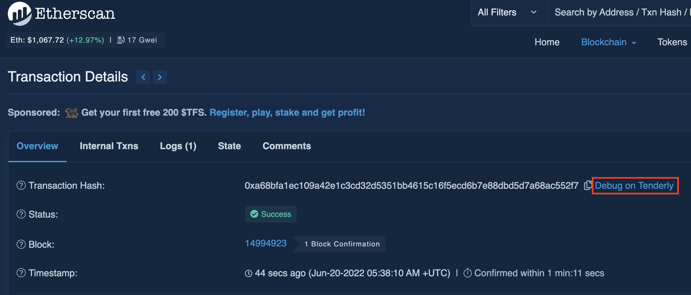

# tenderly-dappmod
Tenderly Utils via Tampermonkey Script

## Requisites

Install Tampermonkey [Chrome](https://chrome.google.com/webstore/detail/tampermonkey/dhdgffkkebhmkfjojejmpbldmpobfkfo) or [Firefox](https://addons.mozilla.org/it/firefox/addon/tampermonkey/)

## Install

Install [Tenderly-Dappmod](https://github.com/emilianobonassi/tenderly-dappmod/raw/main/tenderly-dappmod.user.js)

## Features

- show tenderly debug direct link on etherscan transaction detail page

## Examples

